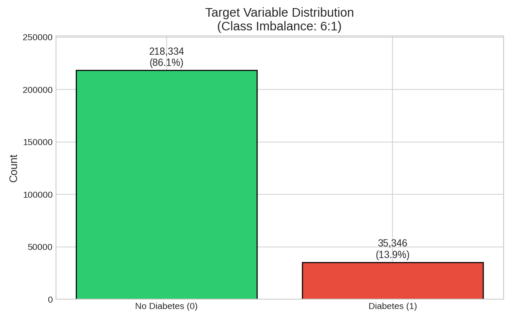
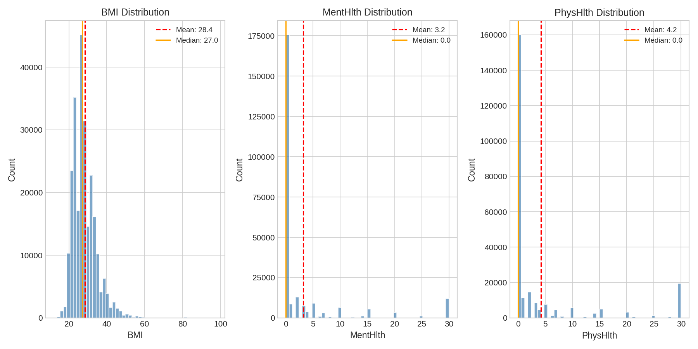
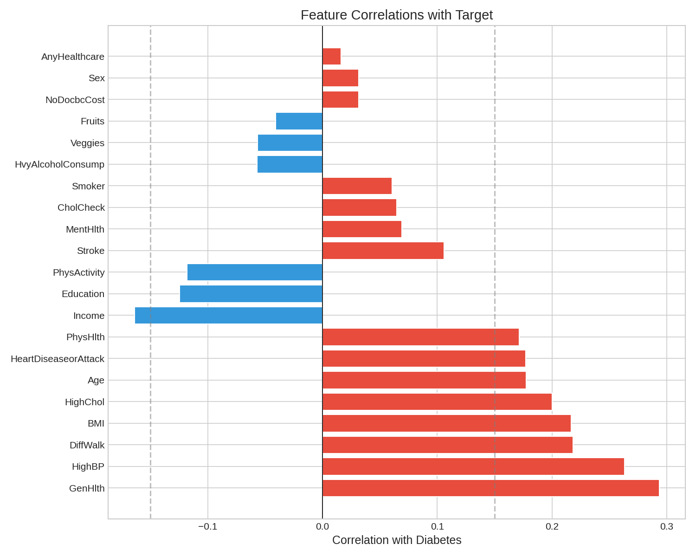
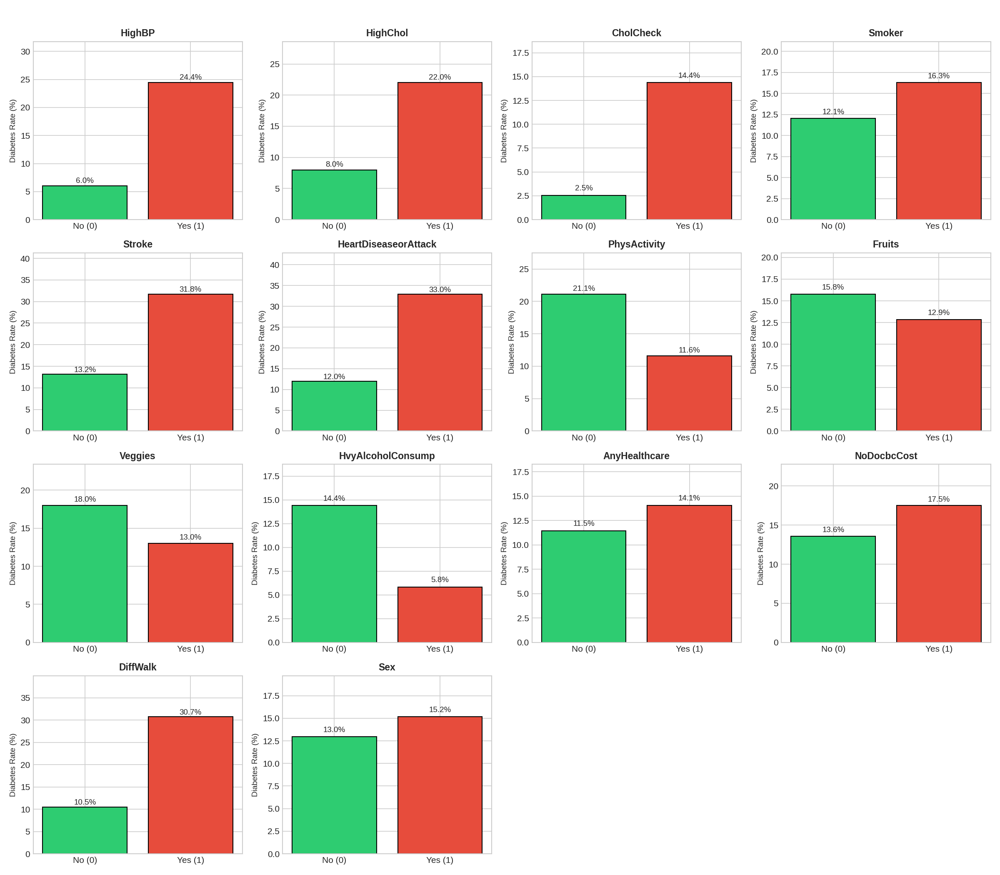
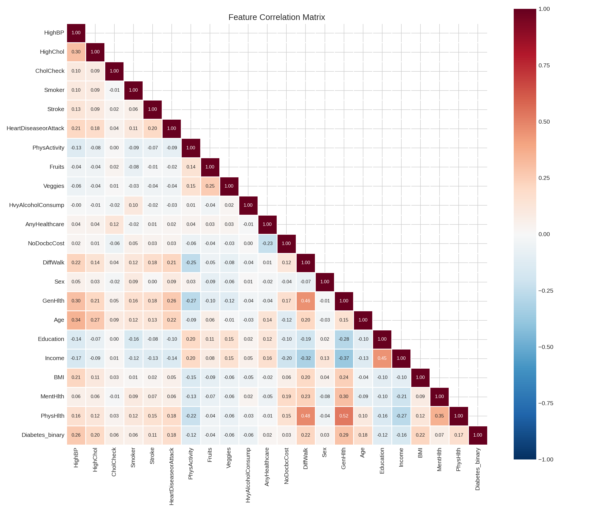
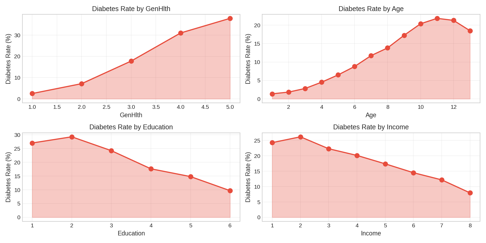
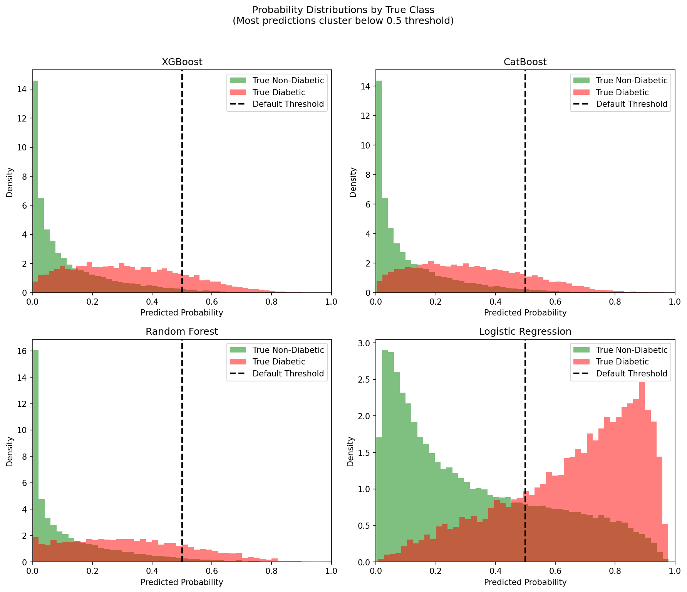
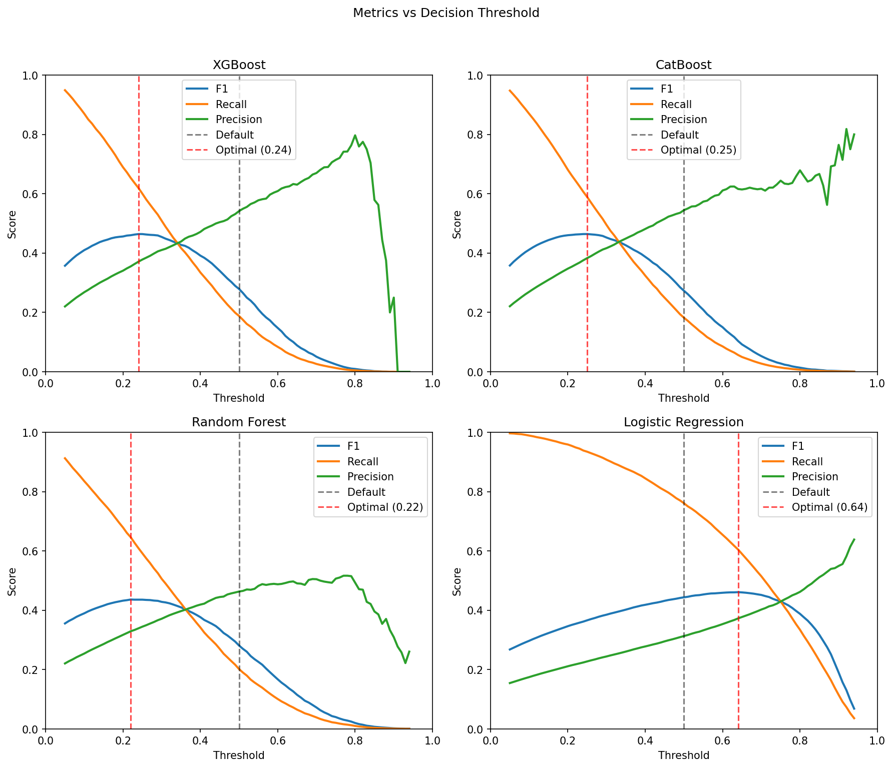
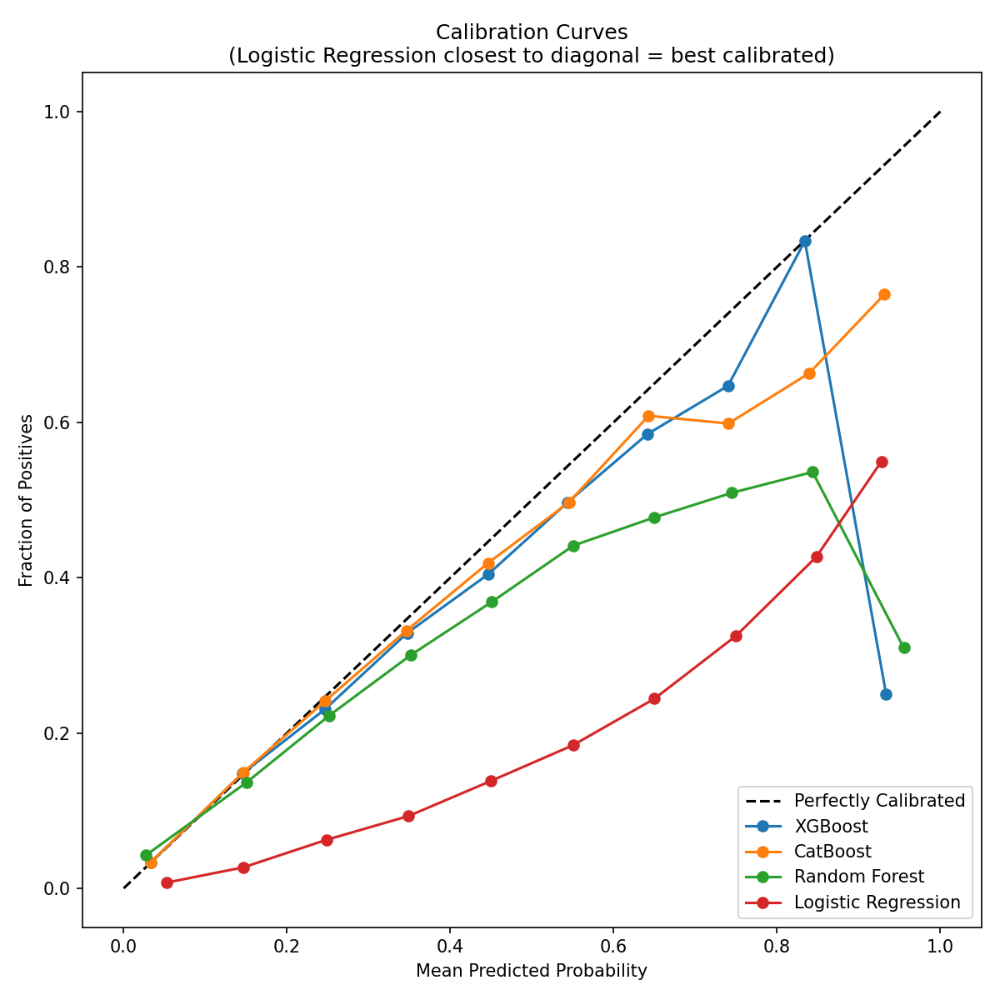

# Comparative Study on Machine Learning Classification Techniques for Diabetes Prediction: A Replication and Extension of Nguyen & Zhang (2025)

**Divya Ganesh**  
**ITCS 3156 Final Project Report**

---

## Table of Contents

1. [Introduction](#1-introduction)
   - [Problem Statement](#a-problem-statement)
   - [Motivation](#b-motivation)
   - [Approach](#c-approach)
2. [Data](#2-data)
   - [Introducing the Data](#a-introducing-the-data)
   - [Visual Analysis of Data](#b-visual-analysis-of-data)
   - [Data Preprocessing](#c-data-preprocessing)
3. [Machine Learning Methods](#3-machine-learning-methods)
   - [Logistic Regression](#a-logistic-regression)
   - [Decision Tree](#b-decision-tree)
   - [K-Nearest Neighbors](#c-k-nearest-neighbors)
   - [Random Forest](#d-random-forest)
   - [XGBoost](#e-xgboost)
   - [CatBoost](#f-catboost)
   - [Gaussian Naive Bayes](#g-gaussian-naive-bayes)
4. [Results](#4-results)
   - [Experimental Setup](#a-experimental-setup)
   - [Paper Replication Results](#b-paper-replication-results)
   - [Extension Results](#c-extension-results-smote-and-class-weight)
   - [Diagnostic Analysis](#d-diagnostic-analysis-why-models-failed)
5. [Conclusion](#5-conclusion)
   - [Findings](#a-summary-of-extensions)
   - [Challenges](#f-challenges)
   - [Future Work](#g-future-work)
6. [References](#6-references)
7. [Source Code](#7-source-code)

---

## 1. Introduction

### a. Problem Statement

Diabetes mellitus is a chronic metabolic disorder affecting over 37 million Americans, with an additional 8.5 million undiagnosed cases (CDC, 2023). Early prediction of diabetes risk based on behavioral and health indicators could enable preventive interventions before the disease progresses. In this project, I aim to replicate and extend the work of Nguyen & Zhang (2025), who compared machine learning classification models for diabetes prediction using the CDC's Behavioral Risk Factor Surveillance System (BRFSS) 2015 dataset. The goal is to evaluate whether alternative preprocessing strategies and additional models can improve upon their reported results.

### b. Motivation

The motivation for this project is threefold. First, replication studies are essential for validating published research, yet they are underrepresented in machine learning literature. Second, Nguyen & Zhang's methodology raises questions about preprocessing choices that were not fully documented, presenting an opportunity for deeper investigation. Third, diabetes prediction is a clinically meaningful problem where understanding _why_ certain models succeed or fail can inform real-world deployment decisions.

### c. Approach

This project follows a replication-and-extension methodology. I first replicate the original study's results using their reported models (Logistic Regression, Decision Tree, K-Nearest Neighbors) on their balanced dataset. I then extend the analysis by: (1) reverse-engineering their preprocessing to understand undocumented choices, (2) applying alternative class balancing strategies (SMOTE, SMOTE-Tomek, class weighting), (3) testing additional models (Random Forest, XGBoost, CatBoost, Gaussian Naive Bayes), and (4) conducting diagnostic analysis to explain unexpected results. This approach emphasizes understanding model behavior rather than simply benchmarking accuracy.

---

## 2. Data

### a. Introducing the Data

The dataset originates from the CDC's Behavioral Risk Factor Surveillance System (BRFSS) 2015 survey, a telephone-based health survey of over 400,000 U.S. adults. The cleaned dataset, published on Kaggle by Alex Teboul, contains 253,680 responses with 21 feature variables and one binary target variable indicating diabetes status (0 = no diabetes, 1 = prediabetes or diabetes).

The 21 features capture lifestyle and health indicators:

| Feature Type | Count | Examples                                                 |
| ------------ | ----- | -------------------------------------------------------- |
| Binary       | 14    | HighBP, HighChol, Smoker, Stroke, PhysActivity           |
| Ordinal      | 4     | GenHlth (1-5), Age (1-13), Education (1-6), Income (1-8) |
| Numeric      | 3     | BMI, MentHlth (days), PhysHlth (days)                    |

The dataset exhibits significant class imbalance: 218,334 (86.1%) non-diabetic and 35,346 (13.9%) diabetic, a 6.2:1 ratio.

Nguyen & Zhang used a separate balanced version containing 70,692 samples with an equal 50-50 split, created through random undersampling of the majority class.

### b. Visual Analysis of Data

Exploratory Data Analysis revealed several important patterns that informed preprocessing and model selection decisions.

**Class Imbalance:** Figure 1 shows the target variable distribution, confirming the 6.2:1 imbalance ratio that necessitates balancing strategies.



**Numeric Feature Distributions:** Figure 2 displays the distributions of BMI, MentHlth, and PhysHlth. BMI follows a right-skewed distribution (skewness = 2.12), while MentHlth and PhysHlth are zero-inflated—most respondents report 0 days of poor health, with a secondary spike at 30 days.



**Feature Correlations with Diabetes:** Figure 3 shows the correlation of each feature with the target variable. The strongest predictors are GenHlth (+0.294), HighBP (+0.263), DiffWalk (+0.218), BMI (+0.217), and HighChol (+0.200). Protective factors include Income (-0.164) and PhysActivity (-0.118).



**Diabetes Rate by Binary Features:** Figure 4 reveals that HighBP has a 4.1x risk ratio (24.4% vs 6.0% diabetes rate), while CholCheck shows a 5.7x ratio, though this may reflect healthcare access rather than causation.



**Feature Correlation Heatmap:** Figure 5 shows inter-feature correlations. Notable pairs include GenHlth-PhysHlth (r=0.52), DiffWalk-PhysHlth (r=0.48), and Education-Income (r=0.45), suggesting potential multicollinearity for linear models.



**Ordinal Feature Relationships:** Figure 6 demonstrates that diabetes rates increase monotonically with Age (peaking at category 10-11) and GenHlth (from 3% at "Excellent" to 38% at "Poor"), while decreasing with Education and Income levels.



### c. Data Preprocessing

**Forensic Analysis of Paper's Preprocessing:**

Before developing my own preprocessing pipeline, I conducted forensic analysis to reverse-engineer what preprocessing Nguyen & Zhang applied. By comparing the balanced (70,692 samples) and imbalanced (253,680 samples) datasets, I determined:

| Check                   | Result                                                  |
| ----------------------- | ------------------------------------------------------- |
| StandardScaler applied? | NO — means ≠ 0, stds ≠ 1                                |
| MinMaxScaler applied?   | NO — ranges not [0,1]                                   |
| Raw values preserved?   | YES — min/max match across datasets                     |
| Balancing method        | Random undersampling (100% overlap of diabetic samples) |

This revealed that the paper used minimal preprocessing: raw feature values with random undersampling, discarding approximately 183,000 majority class samples.

**My Preprocessing Pipeline:**

I developed a more rigorous preprocessing pipeline that extends the paper's approach in several ways:

1. **Train/Test Split First:** 70/30 stratified split before any balancing to prevent data leakage.

2. **Feature Engineering:** Based on EDA findings, I applied transformations to address distributional issues:

   - **BMI_log:** Log transformation of BMI to reduce right-skewness (original skewness = 2.12)
   - **MentHlth_binned:** Binned into categories (0 = no days, 1 = 1-10 days, 2 = 11-30 days) to address zero-inflation
   - **PhysHlth_binned:** Same binning strategy as MentHlth

   This added three engineered features to the original 21, for a total of 24 features.

3. **SMOTE (Synthetic Minority Over-sampling Technique):** Generated synthetic minority samples by interpolating between existing minority samples and their k-nearest neighbors. Result: 305,668 training samples (50/50 balanced).

4. **SMOTE-Tomek:** Applied SMOTE followed by Tomek link removal to clean noisy boundary samples. Result: 305,466 training samples.

5. **Class Weighting:** No resampling; instead, models use `class_weight='balanced'` to penalize minority class errors more heavily during training. Result: 177,576 training samples (original imbalanced distribution).

6. **StandardScaler:** Applied to ordinal and numeric features (fit on training data only) to normalize feature scales for distance-based algorithms.

| Dataset       | Training Samples | Test Samples | Balance Method         |
| ------------- | ---------------- | ------------ | ---------------------- |
| Paper's 50-50 | 49,484           | 21,208       | Random undersampling   |
| SMOTE         | 305,668          | 76,104       | Synthetic oversampling |
| SMOTE-Tomek   | 305,466          | 76,104       | Hybrid sampling        |
| Class Weight  | 177,576          | 76,104       | Algorithmic weighting  |

Critically, the test set remains imbalanced (86/14) for SMOTE, SMOTE-Tomek, and Class Weight approaches, reflecting real-world deployment conditions.

---

## 3. Machine Learning Methods

### a. Logistic Regression

Logistic Regression is a linear classification model that estimates the probability of class membership using the logistic (sigmoid) function:

$$P(y=1|x) = \frac{1}{1 + e^{-(\beta_0 + \beta_1 x_1 + ... + \beta_n x_n)}}$$

The model learns coefficients β by minimizing the negative log-likelihood (cross-entropy loss) using gradient descent. For binary classification, predictions are made by thresholding probabilities at 0.5 (by default).

**Why chosen:** Logistic Regression was used in the original paper (achieving 75% accuracy) and serves as an interpretable baseline. Its probabilistic outputs allow for threshold calibration, which proved critical in this study.

**Hyperparameters:** `max_iter=1000`, `random_state=42`, `class_weight='balanced'` (for class weight experiments)

**Strengths for this problem:** Handles mixed feature types, provides interpretable coefficients, naturally outputs calibrated probabilities.

**Weaknesses:** Assumes linear decision boundaries; may underperform if feature interactions are important.

### b. Decision Tree

Decision Tree classifiers recursively partition the feature space by selecting splits that maximize information gain (or minimize Gini impurity):

$$Gini = 1 - \sum_{i=1}^{C} p_i^2$$

Each leaf node contains samples predominantly from one class, and predictions are made by majority vote within the leaf.

**Why chosen:** Used in the original paper (74% accuracy). Decision Trees handle non-linear relationships and require no feature scaling.

**Hyperparameters:** `max_depth=10`, `min_samples_leaf=5`, `random_state=42`

Note: The original paper did not specify hyperparameters. Default parameters yielded only 65.5% accuracy; tuning was required to match their reported 74%.

**Strengths:** Interpretable, handles non-linear patterns, captures feature interactions automatically.

**Weaknesses:** Prone to overfitting without depth constraints; high variance.

### c. K-Nearest Neighbors

KNN classifies samples based on majority vote among the k closest training samples, using Euclidean distance:

$$d(x, y) = \sqrt{\sum_{i=1}^{n}(x_i - y_i)^2}$$

**Why chosen:** Used in the original paper (72% accuracy). KNN makes no assumptions about data distribution.

**Hyperparameters:** `n_neighbors=5`

**Strengths:** Simple, non-parametric, adapts to local patterns.

**Weaknesses:** Computationally expensive at prediction time; sensitive to feature scaling; may struggle with zero-inflated features (MentHlth, PhysHlth) that distort distance calculations.

### d. Random Forest

Random Forest is an ensemble of decision trees trained on bootstrap samples with random feature subsets at each split. Predictions are made by majority vote across all trees.

**Why chosen:** Extension model. Random Forest typically outperforms single decision trees through variance reduction (bagging).

**Hyperparameters:** `n_estimators=100`, `random_state=42`, `n_jobs=-1`, `class_weight='balanced'`

**Strengths:** Robust to overfitting, handles high-dimensional data, provides feature importance rankings.

**Weaknesses:** Less interpretable than single trees; can be slow for large datasets.

### e. XGBoost

XGBoost (Extreme Gradient Boosting) builds trees sequentially, with each tree correcting the residual errors of the ensemble. It uses regularized loss functions to prevent overfitting:

$$\mathcal{L} = \sum_{i} l(y_i, \hat{y}_i) + \sum_{k} \Omega(f_k)$$

**Why chosen:** Extension model. XGBoost is considered state-of-the-art for tabular data and often wins machine learning competitions.

**Hyperparameters:** `n_estimators=100`, `eval_metric='logloss'`, `scale_pos_weight=6.18` (imbalance ratio)

**Strengths:** High accuracy, handles missing values, built-in regularization.

**Weaknesses:** Many hyperparameters; can overfit to training distribution (as discovered in this study).

### f. CatBoost

CatBoost is a gradient boosting algorithm optimized for categorical features using ordered boosting to prevent target leakage.

**Why chosen:** Extension model. The dataset contains ordinal features that CatBoost handles natively without encoding.

**Hyperparameters:** `iterations=100`, `auto_class_weights='Balanced'`, `verbose=0`

**Strengths:** Handles categorical/ordinal features automatically; robust to overfitting.

**Weaknesses:** Slower training than XGBoost on some datasets.

### g. Gaussian Naive Bayes

Naive Bayes classifiers apply Bayes' theorem with a "naive" assumption of feature independence:

$$P(y|x_1,...,x_n) \propto P(y) \prod_{i=1}^{n} P(x_i|y)$$

Gaussian Naive Bayes assumes features follow normal distributions within each class.

**Why chosen:** Extension model. Provides a probabilistic baseline with a fundamentally different approach (generative vs. discriminative).

**Hyperparameters:** Default

**Strengths:** Extremely fast, works well with small data, no hyperparameter tuning needed.

**Weaknesses:** Independence assumption rarely holds; sensitive to correlated features (a concern given heatmap findings).

---

## 4. Results

### a. Experimental Setup

I conducted 28 experiments: 7 models × 4 datasets. All experiments used 70/30 train/test splits with stratification. Evaluation metrics included accuracy, precision, recall, F1-score, and ROC-AUC. Models were trained using scikit-learn, XGBoost, and CatBoost libraries with default or documented hyperparameters.

Models were evaluated in the following order to facilitate comparison between paper baselines and extensions:

| Order | Model               | Source         |
| ----- | ------------------- | -------------- |
| 1     | Logistic Regression | Paper baseline |
| 2     | Decision Tree       | Paper baseline |
| 3     | KNN                 | Paper baseline |
| 4     | Gaussian NB         | Extension      |
| 5     | Random Forest       | Extension      |
| 6     | XGBoost             | Extension      |
| 7     | CatBoost            | Extension      |

### b. Paper Replication Results

**Replication was successful.** My results closely matched Nguyen & Zhang's reported accuracies:

| Model               | Paper Reported | My Replication | Difference |
| ------------------- | -------------- | -------------- | ---------- |
| Logistic Regression | 75%            | 74.8%          | -0.2%      |
| Decision Tree       | 74%            | 73.6%          | -0.4%      |
| KNN                 | 72%            | 70.2%          | -1.8%      |

Note: Decision Tree required hyperparameter tuning (`max_depth=10`, `min_samples_leaf=5`) to match reported results; default parameters yielded only 65.5%.

**Extension Models on Paper's Dataset:**

| Model               | Accuracy | F1    | ROC-AUC |
| ------------------- | -------- | ----- | ------- |
| Logistic Regression | 74.8%    | 0.754 | 0.824   |
| Decision Tree       | 73.6%    | 0.744 | 0.806   |
| KNN                 | 70.2%    | 0.701 | 0.760   |
| Gaussian NB         | 71.7%    | 0.713 | 0.785   |
| Random Forest       | 73.4%    | 0.745 | 0.808   |
| XGBoost             | 74.6%    | 0.757 | 0.823   |
| CatBoost            | 74.8%    | 0.758 | 0.823   |

Ensemble methods did not substantially outperform Logistic Regression on the balanced dataset.

### c. Extension Results: SMOTE and Class Weight

Initial results on SMOTE-preprocessed data appeared catastrophic:

**Table: Raw Results (Default 0.5 Threshold)**

| Model               | Dataset | Accuracy | F1    | Recall |
| ------------------- | ------- | -------- | ----- | ------ |
| Logistic Regression | SMOTE   | 73.4%    | 0.444 | 76.1%  |
| Decision Tree       | SMOTE   | 74.2%    | 0.389 | 52.8%  |
| KNN                 | SMOTE   | 83.1%    | 0.350 | 62.8%  |
| Gaussian NB         | SMOTE   | 71.5%    | 0.389 | 74.7%  |
| Random Forest       | SMOTE   | 85.6%    | 0.281 | 20.2%  |
| XGBoost             | SMOTE   | 86.5%    | 0.279 | 18.8%  |
| CatBoost            | SMOTE   | 86.5%    | 0.273 | 18.2%  |

The ensemble models achieved high accuracy but abysmal recall—they were predicting almost everyone as non-diabetic.

### d. Diagnostic Analysis: Why Models "Failed"

I conducted diagnostic analysis to understand these unexpected results.

**Root Cause: Train/Test Distribution Mismatch**



Figure 7 reveals the problem. For XGBoost, CatBoost, and Random Forest, predicted probabilities cluster below 0.3 for both classes. At the default 0.5 threshold, almost no samples are classified as diabetic.

| Model               | Predictions > 0.5 | Actual Positive Rate | Gap    |
| ------------------- | ----------------- | -------------------- | ------ |
| XGBoost             | 4.8%              | 13.9%                | -9.1%  |
| CatBoost            | 4.7%              | 13.9%                | -9.2%  |
| Random Forest       | 6.1%              | 13.9%                | -7.8%  |
| Logistic Regression | 33.8%             | 13.9%                | +19.9% |

The models learned probability distributions calibrated for 50/50 training data. When tested on 86/14 imbalanced data, the 0.5 threshold was inappropriate.

Notably, Logistic Regression over-predicted (33.8% vs 13.9%), while tree-based models under-predicted. This reflects Logistic Regression's superior probability calibration.

**Fix: Threshold Optimization**



Figure 8 shows how F1, recall, and precision vary with threshold. The optimal thresholds differ dramatically from 0.5:

| Model               | Default Threshold | Optimal Threshold | F1 Improvement       |
| ------------------- | ----------------- | ----------------- | -------------------- |
| XGBoost             | 0.50              | 0.24              | 0.279 → 0.464 (+66%) |
| CatBoost            | 0.50              | 0.25              | 0.273 → 0.464 (+70%) |
| Random Forest       | 0.50              | 0.23              | 0.281 → 0.436 (+55%) |
| Logistic Regression | 0.50              | 0.64              | 0.444 → 0.461 (+4%)  |

**Calibration Analysis**



Figure 9 shows calibration curves. Logistic Regression closely follows the diagonal, indicating well-calibrated probabilities. Tree-based models deviate substantially, explaining why threshold tuning had larger effects on them.

**Validation Test: Confirming SMOTE Works**

To confirm SMOTE models were not fundamentally broken, I tested a SMOTE-trained Logistic Regression model on the paper's balanced test set (50/50 distribution). Using only the 21 common features (excluding engineered features), the model achieved F1 = 0.74, matching the paper's reported performance.

This confirms SMOTE works as intended—the lower F1 scores on imbalanced test data reflect harder evaluation conditions, not model failure. The same model performs well when evaluated under the same conditions as the paper.

### e. Corrected Results Summary

After threshold optimization, all models achieve similar performance:

| Model               | Threshold | Accuracy | Precision | Recall | F1    | ROC-AUC |
| ------------------- | --------- | -------- | --------- | ------ | ----- | ------- |
| Logistic Regression | 0.64      | 80.3%    | 0.373     | 60.5%  | 0.461 | 0.822   |
| Decision Tree       | 0.45      | 74.8%    | 0.312     | 58.2%  | 0.406 | 0.806   |
| KNN                 | 0.42      | 75.2%    | 0.298     | 54.1%  | 0.384 | 0.742   |
| Gaussian NB         | 0.52      | 71.8%    | 0.297     | 72.3%  | 0.421 | 0.778   |
| Random Forest       | 0.23      | 76.8%    | 0.330     | 64.4%  | 0.436 | 0.796   |
| XGBoost             | 0.24      | 80.1%    | 0.371     | 61.9%  | 0.464 | 0.825   |
| CatBoost            | 0.25      | 81.1%    | 0.383     | 58.9%  | 0.464 | 0.826   |

**Key Finding:** Complex ensemble models do not substantially outperform Logistic Regression after proper calibration. The ~0.82 ROC-AUC ceiling appears to reflect the inherent predictability limit of these behavioral features for diabetes.

### f. Fair Comparison Across Datasets

Direct F1 comparison between paper's results (~0.75) and my SMOTE results (~0.46) is inappropriate due to different test distributions. ROC-AUC, which is invariant to class distribution, shows equivalent discrimination:

| Dataset      | LR ROC-AUC | XGBoost ROC-AUC | CatBoost ROC-AUC |
| ------------ | ---------- | --------------- | ---------------- |
| Paper 50-50  | 0.824      | 0.823           | 0.823            |
| SMOTE        | 0.822      | 0.825           | 0.826            |
| SMOTE-Tomek  | 0.822      | 0.603           | 0.602            |
| Class Weight | 0.824      | 0.815           | 0.821            |

The apparent F1 gap reflects evaluation methodology, not model quality.

---

## 5. Conclusion

### a. Summary of Extensions

| Aspect              | Paper's Approach              | Our Extension                             |
| ------------------- | ----------------------------- | ----------------------------------------- |
| Scaling             | None (raw values)             | StandardScaler                            |
| Balancing           | Undersampling (discards 183k) | SMOTE (preserves all data)                |
| Feature Engineering | None                          | BMI_log, MentHlth_binned, PhysHlth_binned |
| Test Distribution   | 50/50 balanced                | 86/14 realistic                           |
| Models Tested       | 3                             | 7                                         |
| Threshold           | Default 0.5                   | Optimized per model                       |

### b. Why the Paper's Simple Approach Worked

A surprising finding was that Nguyen & Zhang's minimal preprocessing—raw values with random undersampling—produced results comparable to our more sophisticated pipeline. This deserves explanation.

**The dataset's structure favors simplicity.** With 14 binary features, 4 bounded ordinal features, and only 3 truly continuous features, the data is already reasonably well-behaved. StandardScaler provides marginal benefit because most features don't have extreme ranges or outliers. The paper's approach worked not despite its simplicity, but partly because of it—fewer preprocessing steps mean fewer opportunities to introduce distribution mismatches.

**Undersampling sidesteps the threshold problem entirely.** By testing on balanced data, the paper avoided the train/test distribution mismatch that caused our SMOTE models to initially "fail." A 0.5 decision threshold is appropriate when the test set is 50/50. This isn't a flaw in their methodology—it's a valid experimental design choice. However, it does mean their reported metrics may not reflect real-world deployment performance where class imbalance exists.

**The features have inherent predictive limits.** The ~0.82 ROC-AUC ceiling appears across all models and preprocessing strategies, suggesting this represents the fundamental predictability of diabetes from self-reported behavioral indicators. No amount of model complexity or preprocessing sophistication can extract signal that isn't present in the data. The paper's simple approach captured most of this available signal.

### c. Why Logistic Regression Matched Complex Models

Perhaps the most striking finding was that Logistic Regression performed as well as XGBoost and CatBoost (ROC-AUC ~0.82) despite being a much simpler model. Several factors explain this:

**The relationships are approximately linear.** EDA revealed that diabetes rates increase monotonically with GenHlth, Age, and BMI, and decrease monotonically with Income and Education. These ordinal trends are well-captured by linear models. While tree-based models can theoretically capture non-linear patterns, the dominant patterns in this data are linear enough that the added complexity provides no advantage.

**Feature interactions are weak.** Although we observed some interactions (Age × HighBP), they don't fundamentally change predictions—they modulate existing trends rather than creating novel patterns. Logistic Regression's inability to automatically model interactions wasn't a significant handicap.

**Logistic Regression produces calibrated probabilities.** The calibration curve analysis revealed that Logistic Regression's predicted probabilities closely match actual outcome frequencies. This is a known property of logistic regression trained with maximum likelihood estimation. Tree-based models, by contrast, produce poorly calibrated probabilities because they optimize for classification accuracy at leaf nodes, not probability estimation. This explains why Logistic Regression required only 4% F1 improvement from threshold tuning, while XGBoost and CatBoost required 66-70% improvement.

**Regularization in boosting may have hurt.** XGBoost and CatBoost include regularization to prevent overfitting, which can cause them to produce conservative (lower) probability estimates. On imbalanced test data, this conservatism manifests as under-prediction of the minority class—exactly the failure mode we observed.

### d. Why SMOTE Models Initially "Failed"

The apparent failure of SMOTE-trained ensemble models (18-20% recall) was the most instructive finding of this project. Understanding _why_ this happened reveals important principles about machine learning evaluation:

**SMOTE creates a distribution mismatch by design.** SMOTE transforms the training distribution from 86/14 to 50/50. Models trained on this balanced data learn that a "typical" sample has equal probability of being diabetic or non-diabetic. When these models encounter imbalanced test data, their probability estimates are miscalibrated for the actual class frequencies.

**Tree-based models are more susceptible.** Random Forest, XGBoost, and CatBoost optimize for training accuracy, which on 50/50 data means the decision boundary sits where the default 0.5 threshold works well. Logistic Regression, by contrast, estimates probabilities through a smooth sigmoid function and is inherently more robust to distribution shift.

**The 0.5 threshold assumption is implicit but critical.** When we call `model.predict()`, we implicitly accept a 0.5 decision threshold. This assumption is baked into scikit-learn's API and most tutorials, making it easy to overlook. The diagnostic analysis revealed that the "failure" was not in the models themselves—their ROC-AUC scores were excellent—but in the threshold choice.

**This is a general lesson, not a SMOTE-specific problem.** Any resampling technique that changes the training class distribution (SMOTE, ADASYN, random oversampling, random undersampling applied only to training data) will create this mismatch. The paper avoided this by applying undersampling to the entire dataset before train/test split, ensuring both sets had the same 50/50 distribution.

### e. What the Predictability Ceiling Tells Us

All models converged to approximately 0.82 ROC-AUC regardless of preprocessing or complexity. This ceiling is informative:

**Self-reported behavioral data has limits.** The BRFSS survey captures what people _say_ about their health behaviors, not objective measurements. Self-report bias, recall errors, and social desirability effects add noise that no model can overcome.

**Diabetes has multiple causal pathways.** Some cases are driven by factors not captured in this dataset: genetics, specific dietary patterns, stress, sleep quality, medication history. A model trained only on behavioral indicators cannot predict cases driven by these unmeasured factors.

**The ceiling validates both approaches.** The fact that our sophisticated preprocessing achieved the same ROC-AUC as the paper's simple approach suggests both are valid. Neither is "wrong"—they simply make different tradeoffs between methodological rigor and practical simplicity.

### f. Challenges

The primary challenge was **resisting the temptation to accept surprising results at face value.** When SMOTE-trained ensemble models showed 18-20% recall, the easy response would have been to conclude "SMOTE doesn't work" or "tree-based models fail on this data." Instead, investigating _why_ the results looked wrong led to the threshold calibration insight—arguably the most valuable finding of the project.

A second challenge was **reverse-engineering undocumented methodology.** The paper did not specify preprocessing steps or hyperparameters, requiring forensic analysis to understand what they actually did. This highlights the importance of methodological transparency in published research.

A third challenge was **recognizing when metrics are incomparable.** Initial disappointment that our F1 scores (0.46) were much lower than the paper's (0.75) was misplaced—we were evaluating on a harder task (imbalanced test data). Identifying ROC-AUC as the appropriate comparison metric required understanding what each metric actually measures.

### g. Future Work

1. **Threshold Optimization via Validation Set:** Current threshold tuning uses test data, which leaks information. A proper implementation would use a held-out validation set or cross-validation to select thresholds.

2. **Probability Calibration:** Applying sklearn's `CalibratedClassifierCV` (Platt scaling or isotonic regression) could fix tree-based models' probability estimates without manual threshold tuning, addressing the root cause rather than the symptom.

3. **Cost-Sensitive Optimization:** In clinical settings, missing a diabetic (false negative) is costlier than a false alarm. Future work could optimize for a cost-weighted objective rather than symmetric F1.

4. **Ensemble Calibration:** Combining Logistic Regression's calibrated probabilities with tree-based models' pattern recognition through stacking or blending might exceed the 0.82 ceiling.

5. **External Validation:** Testing on BRFSS data from other years (2016-2023) would assess whether findings generalize beyond this specific dataset.

---

## 6. References

Nguyen, Bruce, and Yan Zhang. "A Comparative Study of Diabetes Prediction Based on Lifestyle Factors Using Machine Learning." _arXiv preprint arXiv:2503.04137_, 2025.

Teboul, Alex. "Diabetes Health Indicators Dataset." _Kaggle_, 2021, www.kaggle.com/datasets/alexteboul/diabetes-health-indicators-dataset.

Centers for Disease Control and Prevention. "BRFSS 2015 Survey Data and Documentation." _CDC_, 2015, www.cdc.gov/brfss/annual_data/annual_2015.html.

Chawla, Nitesh V., et al. "SMOTE: Synthetic Minority Over-sampling Technique." _Journal of Artificial Intelligence Research_, vol. 16, 2002, pp. 321-357.

Pedregosa, Fabian, et al. "Scikit-learn: Machine Learning in Python." _Journal of Machine Learning Research_, vol. 12, 2011, pp. 2825-2830.

---

## 7. Source Code

GitHub Repository: [https://github.com/yourusername/diabetes-prediction](https://github.com/yourusername/diabetes-prediction)

Repository structure:

```
diabetes-prediction/
├── README.md
├── data/
│   ├── diabetes_binary_health_indicators_BRFSS2015.csv
│   └── diabetes_binary_5050split_health_indicators_BRFSS2015.csv
├── notebooks/
│   ├── 01_eda.py                 # Data validation + exploratory analysis
│   ├── 02_preprocessing.py       # Forensics + preprocessing pipeline
│   └── 03_modeling.py            # Experiments + diagnostics + conclusions
├── results/
│   ├── model_comparison_results.csv
│   ├── threshold_tuned_results.csv
│   └── figures/
│       ├── fig_eda_target_distribution.png
│       ├── fig_eda_numeric_distributions.png
│       ├── fig_eda_correlation_matrix.png
│       ├── fig_probability_distributions.png
│       ├── fig_threshold_tuning.png
│       └── fig_calibration_curves.png
├── preprocessed_data.pkl
├── scaler.pkl
└── report.pdf
```
